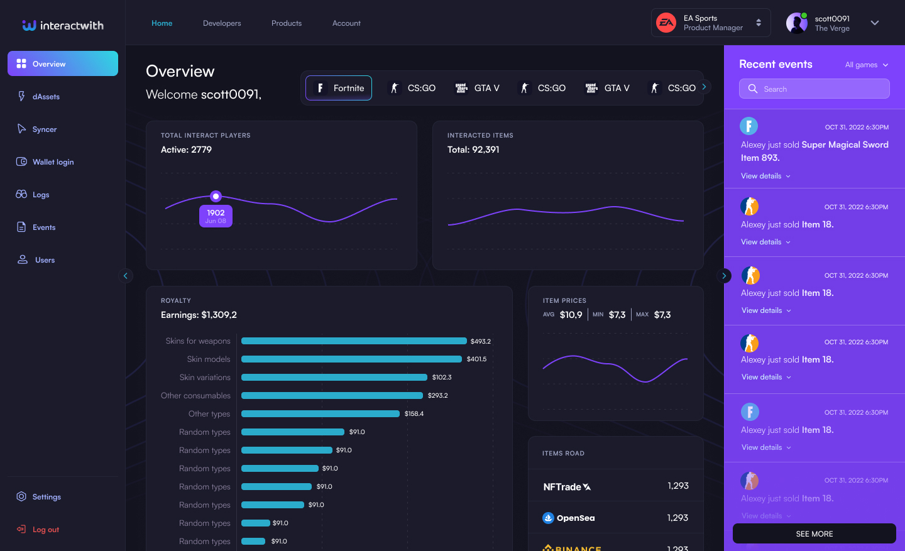

Our dashboard is a powerful and user-friendly tool that makes it easy for app developers to integrate web3 technology into their gaming applications. The dashboard provides a range of features and capabilities that enable developers to create engaging and rewarding user experiences, while also benefiting from the security, interoperability, and value-creation capabilities of web3 technology.

Main key benefit for app developers is that our dashboard simplifies the process of integrating web3 technology into their games. This includes tools and services for creating and managing non-fungible tokens (NFTs), and for enabling seamless data transfer and synchronisation between applications and blockchains.

In addition to simplifying the integration process, our dashboard also provides app developers with valuable insights and analytics that can help them better understand and engage with their users. This includes data on user behavior, asset ownership, and assets trading activity, as well as tools for tracking and analyzing user engagement and feedback.

By providing app developers with these insights and analytics, our dashboard helps them create deeper, more meaningful relationships with their users. This is because it enables developers to understand their users' needs, interests, and preferences, and to tailor their games and user experiences accordingly. This can lead to more engaged and loyal users, and to greater success and revenue for app developers.

Our dashboard for game developers is a valuable tool for app developers who want to leverage the power of web3 technology to create innovative and engaging gaming experiences. By simplifying the integration process and providing valuable insights and analytics, our dashboard helps app developers create deeper and more meaningful relationships with their users, and to achieve greater success and revenue in the web3 gaming market.