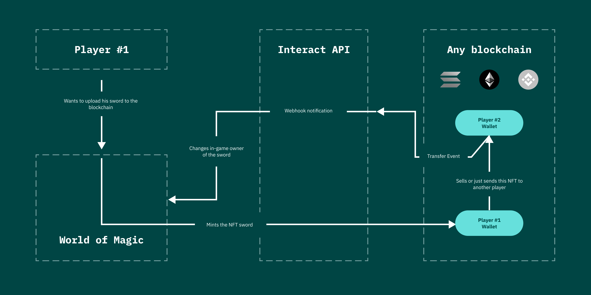

## What is the Minter

Minter is a service that streamlines the creation and management of non-fungible tokens (NFTs) from in-game assets. Minter's innovative technology enables users of integrated apps to mint their in-game assets as NFTs on a blockchain, providing a secure and permanent record of ownership. This allows users to expand their digital identity and use their in-game assets in new and exciting ways. Minter's technology simplifies the process of creating and managing NFTs, making it easy for users to take advantage of the benefits of blockchain technology.

#### Checkout system

One of the standout features of Minter is its streamlined checkout system using both FIAT and cryptocurrency. This convenient system enables users to mint their in-game assets as NFTs on the blockchain quickly and easily. In fact, with this feature, users can mint their assets as NFTs in under 10 seconds. This convenient and efficient payment system is a key part of Minter's offering, making it easy for users to mint their assets and take advantage of the benefits of blockchain technology.

## The Minter API

If you have a game and you want to allow your players to mint their digital assets on the blockchain, you can use InteractWith's API to do this quickly and easily. With just one request to our API, you can mint your players' assets and connect them to the blockchain.

Additionally, our architecture is designed to provide advanced information to app developers through Webhooks or Websockets. This can include information about the movement of assets from one wallet to another, allowing you to track and monitor your players' assets in real-time. This can help you create more engaging and immersive experiences for your players, and can provide valuable insights into how they are using your game.

**When minting assets using InteractWith's API, you do not need to worry about paying any crypto fees or understanding the fees mechanism in each blockchain.** We take care of all gas fees for you, and will charge a fee in fiat periodically for this service. 

However, if the players prefer, they are also free to pay with crypto. Regardless of how they choose to pay, the minting process is quick and easy, and does not require any knowledge of the fees mechanism in different blockchains. We handle everything for you, so you can focus on creating exciting and engaging experiences for your users.

## The Minter usage

This code uses the `Dassets` class from the `@interact/dassets` module to mint an NFT (non-fungible token) on the blockchain. It creates a new `Dassets` instance by passing in an access key, and then calls the `mintNft()` method to mint the NFT. The `mintNft()` method takes an object containing the recipient's address, the local ID of the item being minted, and an idempotency key. After minting the NFT, the code sets up event listeners for `mint` and `transfer` events, which are fired when the NFT is minted or transferred to another wallet. When these events occur, the code updates the item's owner information in the database to reflect the changes on the blockchain.

`import { Dassets } from '@interact/dassets'`

`const dassets_client = new Dassets({
  access_key: 'YOUR_ACCESS_KEY',
})`

`dassets_client.mintNft({
  to: '0x50612AeeDD1F110B16dAD5139ebE7D4200091c7c',
  local_token_id: 'your_item_local_id',
  idempotency_key: 'SOME_RANDOM_IDEMPOTENCY_KEY' // highly recommended to use
});`

`/`
*`you can use either EventListener-style 
  or webhooks to listen for events`*

`dassets_client.on('mint', ({
  token_id, // blockchain id of the item
  local_token_id,
  to,
}) => {
  const item = await Item.findOne({ id: local_token_id });
  item.owner = to;
  item.chain_id = token_id;
  await item.save();
})`

`// this event is fired when an item is transferred to another wallet
dassets_client.on('transfer', ({ token_id, to }) => {
  const item = await Item.findOne({ chain_id: token_id });
  item.owner = to;
  await item.save();
}av`

When using InteractWith's API, all requests have the ability to be idempotent, which means that they can be safely repeated without causing unintended consequences. This is useful if you are worried about accidentally minting the same item multiple times. To use this feature, simply specify an `idempotency_key` when making a request.

In addition, all Webhook requests have a retry policy, which means that they will be automatically retried if they fail for any reason. This ensures that you don't miss any important events or updates, and helps to ensure that your app always has the most up-to-date information.

Finally, all data coming from events is cryptographically protected, which means that you can be sure that it has not been tampered with or altered in any way. This helps to ensure the integrity and security of the data, and allows you to trust that the information you are receiving is accurate and reliable.