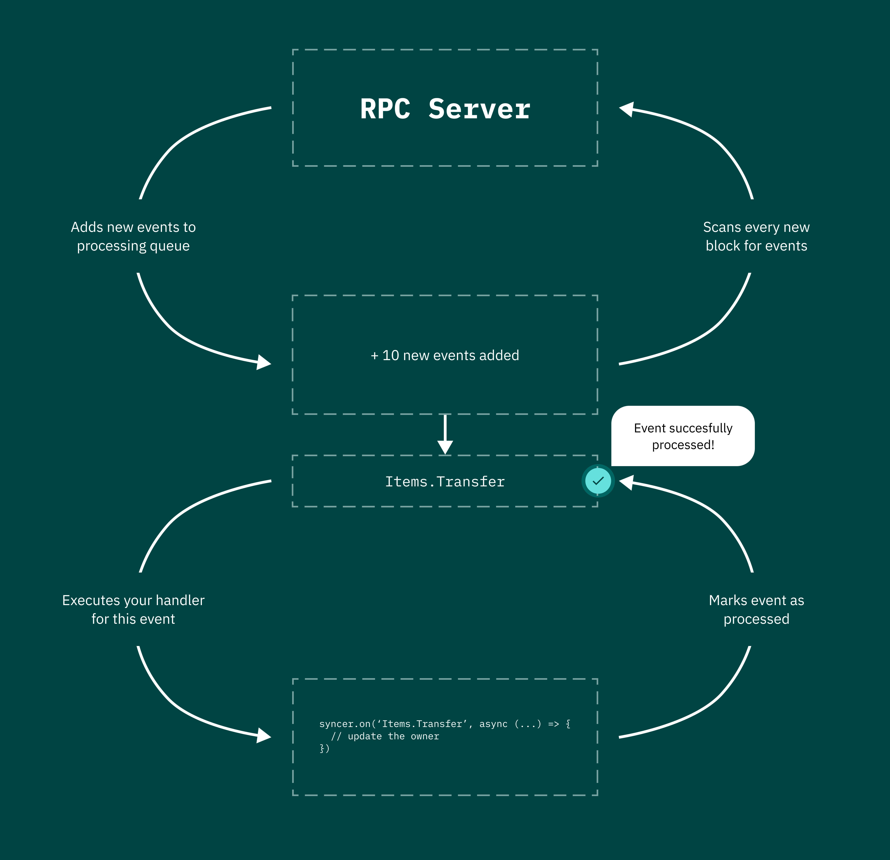
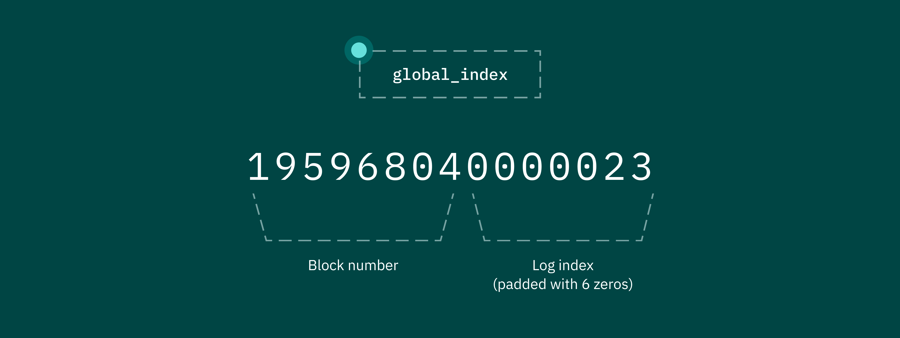

## What is Data Syncer

Data Syncer is a service that offers seamless and continuous synchronization between an app's centralized databases and public decentralized databases. This allows apps to utilize new business models and monetization tools, and to take advantage of the unique capabilities of blockchain technology.

Data Syncer handles delegated indexing of various blockchain networks, providing more flexibility than other solutions. With Data Syncer, data and event handlers can be stored on the client side rather than the service side. This allows for custom logic in the event handler and the ability to add metadata directly from the admin panel without having to write to the blockchain.

The term "delegated" in the description refers to the fact that Data Syncer manages the parts of the indexing process that do not depend on the app's business logic, such as the queue of raw events and quick access to them. The app only needs to retrieve events from the queue and process them as needed. 

## Data Syncer API

As shown in the diagram, the Data Syncer constantly track for new events from contracts that the client specifies. When a new event is detected, it is added to a queue for processing. The events are then passed on to the client for further processing. This simple and straightforward process allows for efficient and effective data synchronization between centralized and decentralized databases. Syncer makes it easy for app developers to access and use the data they need, without having to worry about the complexities of managing and processing data from the blockchain.

## Example Usage

This code imports the `Syncer` class from the `@interact/syncer` module and creates a new `Syncer` instance by passing in an access key. It then sets up an event listener for the `Items.Transfer` event, which is fired when an item is transferred from one address to another on the blockchain. When this event occurs, the code retrieves the item by ID, updates its owner address, and saves the updated information to the database. This allows the app to track and monitor the movement of items on the blockchain and to keep its data in sync with the blockchain.

`import { Syncer } from '@interact/syncer'`

`const syncer_client = new Syncer({
  access_key: 'YOUR_ACCESS_KEY',
});`

`syncer_client.on('Items.Transfer', async (
  from, 
  to, 
  token_id, 
  { global_index, from_address, block_number, block_timestamp, transaction_hash }
) => {`

`  // getting the item by id 
  const item = await Item.findOne({ id: token_id });`

`  // updating owner address
  item.owner = to;`

`  // saving the item
  await item.save();`

`});`

In the example code, we track changes to the owner of an abstract item. When this code is run, the module will search through all events in the contract starting from the block in which the contract was deployed. For each event that is found, the event listener will be executed in parallel mode. This allows the app to track and monitor changes to the item's owner in real-time, and to keep its data in sync with the blockchain. 

By using the `Syncer` module, app developers can easily and efficiently access and use data from the blockchain, without having to worry about the complexities of managing and processing data from the blockchain.

The final argument passed to each event handler is the event metadata. While the names of the fields in the metadata are self-explanatory, there is one field that is particularly important for the correct use of the service: the `global_index` field. This field is essential for ensuring that the service works correctly, and app developers should be sure to take it into account when using the `Syncer` module. By understanding the importance of this field, app developers can make the most of the `Syncer` module and easily access and use data from the blockchain in their applications.

The `global_index` field is the unique ID of each event. Its most important property is that it is automatically incremented, which allows us to apply idempotency to our event handlers. This means that if an event with a particular `global_index` value has already been processed, the event handler will not be executed again for that event. 

This can help to prevent duplicate data and ensure that the app's data stays in sync with the blockchain. By using the `global_index` field, app developers can make the most of the `Syncer` module and easily access and use data from the blockchain in their applications.

### Why do you need the Data Syncer anyway?

In the example, a simple Web3 game is described. The game has a magic item object stored in a smart contract, and a marketplace with a million of these items, each with a durability value. To filter the items by durability, you need to collect all the items and their current durability values. However, without using Data Syncer, this would require calling the `getItem()` method for each item, which would take a long time to process.

Using Data Syncer, however, you can easily and efficiently collect the durability values for all the items. Data Syncer allows you to track and monitor changes to the items on the blockchain in real-time, so you can quickly and easily access the latest information about each item. This makes it much easier and faster to filter the items by durability, and can help you provide a better experience for your users. By using Data Syncer, you can access and use data from the blockchain more easily and efficiently, which can help you create more engaging and immersive experiences for your users.

In this situation, using Data Syncer would be the best solution. You can create an event in the contract that is triggered whenever the durability value for an item changes:

`DurabilityUpdated(uint item_id, uint current_durability);`

After creating the event in the contract, you can start listening for it on your backend:

`syncer_client.on('Items.DurabilityUpdated', async (
  item_id, 
  current_durability, 
  { global_index, from_address, block_number, block_timestamp, transaction_hash }
) => {`

`  // getting the item by id 
  const item = await Item.findOne({ id: item_id });`

`  // updating durability
  item.durability = current_durability;`

`  // saving the item
  await item.save();`

`});`

After using Syncer to listen for events and update the app's database with the latest durability values for each item, your backend will have a complete and up-to-date record of all the items and their relevant durability values. To filter the items by durability, you can simply write a function that queries the database and returns only those items with the desired durability value.