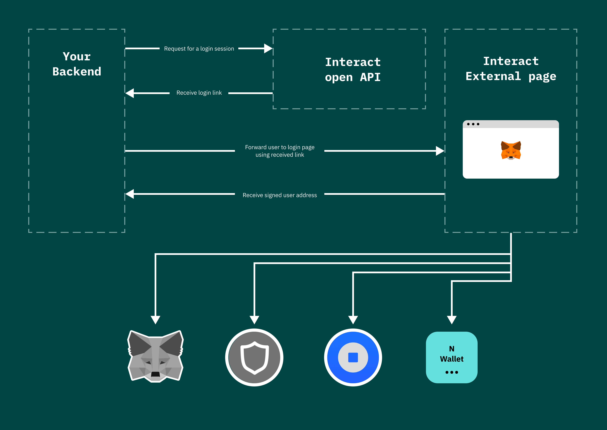

## What is Web3 Auth

Web3 Auth is a tool that empowers app developers by providing them with a new layer of actionable data about their users. The tool allows users to sign in to an app using their web3 digital identity, which provides visibility into the user's blockchain interactions, past balances, holdings of DeFi and NFTs, and other information. This allows for better user segmentation and can lead to improved monetization for app developers.

Web3 Auth is an open and free tool that is easy to integrate into an app. It does not require the installation of any modules, making it particularly useful for game developers who use engines like Unity3D and Unreal Engine. 

Web3 Auth allows them to bypass any cryptography inside their game using a light Webview frame, making it easy to add wallet authorization to their game. This can help developers create more engaging and immersive experiences for their users, and can open up new opportunities for monetization. 

By providing app developers with access to actionable data about their users, Web3 Auth can help them make better business decisions and drive growth.

## Web3 Auth API

Web3 Auth Login is based on the principle of an external session link that is already configured for interactions with all supported wallets. When a user selects their preferred wallet, they are redirected back to the app with a special key. By decrypting this key, the app can access the user's address, which can then be used to link the user's account on the app to their wallet on the blockchain. 

This allows app developers to easily and securely integrate wallet login functionality into their apps, without the need for complex cryptography or security protocols. By using the Interact Wallet Login, app developers can provide users with a convenient and secure way to access their digital assets on the blockchain, and can help to create more engaging and immersive experiences for their users.

## Web3 Auth usage

This code example shows how to use the Web3 Auth Login in a browser environment. The code imports the WalletLogin module from the `@interact/walletlogin` package, and then uses the `requestAddress` method to request the user's wallet address. The `requestAddress` method takes an object as an argument, which includes a `messageToSign` property that specifies the message that will be displayed to the user when they are asked to sign in to their wallet.

Once the `requestAddress` method has been called, it will redirect the user to their preferred wallet to sign in. Once they have signed in, the user will be redirected back to the app, and the `requestAddress` method will resolve with an object that includes the user's wallet address. This address can then be used to link the user's account on the app to their wallet on the blockchain. By using the Web3 Auth Login, app developers can provide users with a convenient and secure way to access their digital assets on the blockchain, and can help to create more engaging and immersive experiences for their users.

`// For browsers
import WalletLogin from '@interact/walletlogin'`

`const { address } = await WalletLogin.requestAddress({
    messageToSign: 'I want to login to MydApp using my wallet',
});`

When this code is run, the browser will open an additional window where the user can choose their wallet and sign the message that was specified in the `messageToSign` property of the `requestAddress` method's argument object. After signing the message, the user will be redirected back to the app, and the `requestAddress` method will resolve with an object that includes the signed message, the user's wallet address, and the original, unsigned message.

The signed message and the unsigned message are included in the returned object to allow the app to cryptographically verify that the signed message was indeed signed by the user's wallet. This helps to prevent various types of hacks and attacks, and ensures that the user's wallet address can be trusted. By using the Interact Wallet Login, app developers can provide users with a convenient and secure way to access their digital assets on the blockchain, and can help to create more engaging and immersive experiences for their users.