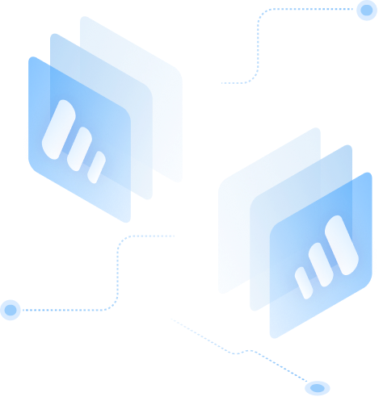

*InteractWith offers a developer program to support projects and teams integrating and expanding our vision.*

The Integration Grant Program is designed to provide advanced app developers, companies, and organizations with the tools and resources they need to integrate InteractWith into their applications. This program is customized to fit the unique needs and requirements of each applicant, and is designed to be flexible and dynamic to ensure that participants can get the most out of the program. 

By participating in the Integration Grant Program, app developers, companies, and organizations can take advantage of InteractWith's suite of products and services to enhance their applications and create more engaging and immersive user experiences.

If you believe that your app development company, organization, or team is a good fit for the Integration Grant Program, we invite you to apply by following the link provided. Once you have submitted your application, our core development team will be in touch with you to discuss the next steps and to work with you to determine the best way to integrate InteractWith into your applications. 

We look forward to working with you and helping you to enhance your apps and create more engaging and immersive user experiences.

LINK TO DEVELOPER PROGRAM QUESTIONAIRE IN WEBSITE